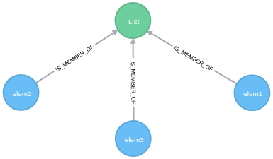
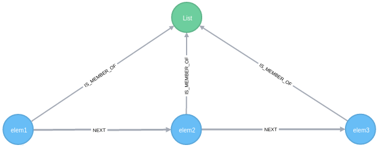
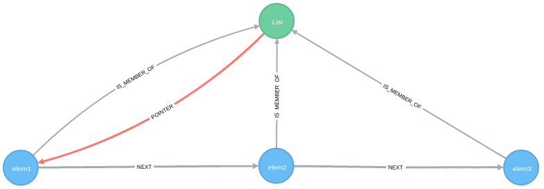
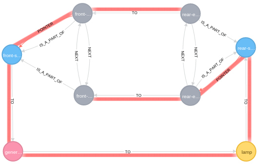
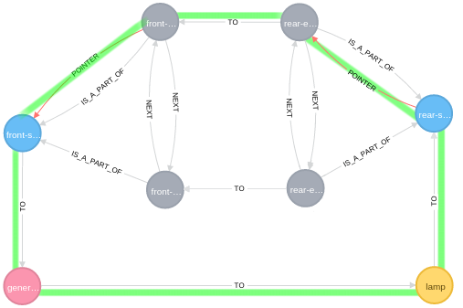

# Moving relationships

## Introduction

A graph database is not only a simple way to store connected data, it is also a powerful tool to manage dynamic relationships between data. 
Since relationships are natively implemented in Neo4j, we can use them as a simple way to identify a group of connected nodes. But it is not the only usage we can make of them.
It seems that there are many use cases where consecutive queries can move the relationships between nodes. Theses relationships are intended to store a particular state for a sub graph like a pointer for example. Let us have a closer look at them.  

## Relationship as a pointer

To observe this behavior, our first example is the famous Linked List. A linked list is a list where each item is ordered according to its relative position compared to the others items. On each call, the currently pointed element is returned and then the pointer moves to the **next** element (like in Java with the Iterator object _iterator ().next ()_ ).

First we need to create a `:LIST` node with three `:ELEMENT`linked to it.

    MERGE (elem1:ELEMENT{name:"elem1"})-[:IS_MEMBER_OF]->(list:LIST{name:"List"})
    MERGE (elem2:ELEMENT{name:"elem2"})-[:IS_MEMBER_OF]->(list)
    MERGE (elem3:ELEMENT{name:"elem3"})-[:IS_MEMBER_OF]->(list)
    

Then we need to link theses elements in an relative ordered way (the initial position is not necessarily important, we chose here to match elements alphabetically ordered by their _name_ property) :

    MERGE (elem:ELEMENT)-[r:IS_MEMBER_OF]->(list:LIST)
    WITH elem ORDER BY elem.name ASC
    WITH COLLECT(elem) AS elems
    FOREACH (n IN RANGE(0, LENGTH(elems)-2) |
    FOREACH (prec IN [elems[n]] |
    FOREACH (next IN [elems[n+1]] |
    MERGE prec-[:NEXT]->next)))

Here we use a loop (the first `FOREACH` clause) to browse the collection of elements and to create a relationship between the previous node and the next node. If you need more explanations about this query, you can find a very interesting post from _Mark Needham_ here: [Neo4j: Cypher – Creating relationships between a collection of nodes](http://www.markhneedham.com/blog/2014/04/19/neo4j-cypher-creating-relationships-between-a-collection-of-nodes-invalid-input/ "Neo4j: Cypher – Creating relationships between a collection of nodes")

The next step consists in placing a pointer at the initial position meaning on the header element of this list (the element without `:NEXT` incoming relationship):

    MATCH (list:LIST)
    MATCH (elem:ELEMENT) WHERE NOT elem<-[:NEXT]-()
    MERGE list-[:POINTER]->elem 

And now, we have to write a typical query which returns the current pointed element and emulates the pointer movement.
Returning current element is simple :

    MATCH (list:LIST)-[:POINTER]->(current:ELEMENT) 
    RETURN current
    
But emulating the pointer movement requires three Cypher operations :

1. Finding the next node
2. Deleting the current pointer relationship
3. Creating a new pointer relationship on the next node

The final query is:

    MATCH (list:LIST)<-[:IS_MEMBER_OF]-(elems:ELEMENT)
    MATCH (list)-[p:POINTER]->(current:ELEMENT) 
    MATCH current-[:NEXT]->(next:ELEMENT) 
    DELETE p 
    MERGE list-[pnew:POINTER]->next
    RETURN DISTINCT list,current,next,pnew,elems
    

__The pointer moved!__

If we take five minutes to have a closer look at the type of the relationships, we have:

* `:IS_MEMBER_OF` to determine what the elements of this list are
* `:NEXT` to determine what the next element to the current one is
* `:POINTER` to determine what the current element is

As we can see, the nature of each relationship type is different. The first two ones have a long lifecycle (as long as the list exists) and the last one has another function: its lifetime may be short because it is only  a volatile state at a given moment.

This is a __moving relationship__!

## Relationships as a three-way switch

Yes, it is a weird title and a strange use case. I think that is interesting to introduce another way of thinking about relationships. Previously we were talking about a relationship as a pointer, now we have to consider __combined states__. And the best example to introduce this notion is the electrical three-way switch.

In the hallway of your house, you need to switch the light on or off from more than one location. You have to be able to switch the light on from the entrance (front switch) and to switch it off from the other end (rear switch), as it would not make sense to consider that you can put the light on only from the posistion where you were the last time you put it off.

In the domain of electricity such a switch is called a three-way switch, and its implementation is as follows :

source : https://en.wikipedia.org/wiki/Multiway_switching

Very well, but what is the link with graphs ?

In the domain of electricity, switching the light on requires a closed circuit to have the light on. In graph theory such a closed circuit is called a _cycle_, meaning that it should be possible to easily convert it in a graph. If we detect a cycle through these elements we can deduct that the lamp is on, whereas if we cannot find a closed cycle, the light remains off.

First we need to give a representation of this schema to Neo4j, and we consider that the initial position is when the light is off:

    CREATE 
    (generator:GENERATOR {name:"generator"}),
    (lamp:LAMP {name:"lamp"}),
    (s1:SWITCH {name:"front-switch"}),
    (e11:ENDPOINT {name:"front-endpoint-1"}),
    (e12:ENDPOINT {name:"front-endpoint-2"}),
    (s2:SWITCH {name:"rear-switch"}),
    (e21:ENDPOINT {name:"rear-endpoint-1"}),
    (e22:ENDPOINT {name:"rear-endpoint-2"}),
    generator-[:TO]->lamp,
    lamp-[:TO]->s2,
    s2-[:POINTER]->e22,
    e22-[:TO]->e12,
    generator<-[:TO]-s1,
    e11-[:POINTER]->s1,
    e11<-[:TO]-e21

The `TO` relationships represent the electrical wires.
The `POINTER` relationships represent the current states of the switches.

But this graph is not sufficient, because we cannot find a next Endpoint from the currently pointed position. We need to build a circular linked list around the endpoints for each switch.

Here is the query for the rear switch:

    MATCH (s2:SWITCH {name:"rear-switch"})
    MATCH (endpoint:ENDPOINT) WHERE endpoint.name=~"rear.*"
    MERGE endpoint-[:IS_A_PART_OF]->s2
    WITH endpoint ORDER BY endpoint.name ASC
    WITH COLLECT(endpoint) AS elems
    FOREACH (n IN RANGE(0, LENGTH(elems)-2) |
    FOREACH (prec IN [elems[n]] |
    FOREACH (next IN [elems[n+1]] |
    MERGE prec-[:NEXT]->next)))
    WITH elems[0] as beginning, elems[LENGTH(elems)-1] as ending
    MERGE beginning<-[:NEXT]-ending

And here is the query for the front switch :

    MATCH (s1:SWITCH {name:"front-switch"})
    MATCH (endpoint:ENDPOINT) WHERE endpoint.name=~"front.*"
    MERGE endpoint-[:IS_A_PART_OF]->s1
    WITH endpoint ORDER BY endpoint.name ASC
    WITH COLLECT(endpoint) AS elems
    FOREACH (n IN RANGE(0, LENGTH(elems)-2) |
    FOREACH (prec IN [elems[n]] |
    FOREACH (next IN [elems[n+1]] |
    MERGE prec-[:NEXT]->next)))
    WITH elems[0] as beginning, elems[LENGTH(elems)-1] as ending
    MERGE beginning<-[:NEXT]-ending

Note that the last query line `MERGE beginning<-[:NEXT]-ending` is useful to link the last element to the first and thus to obtain a circular reference.

__Lamp test query__:

    MATCH (lamp:LAMP)-[r:TO|POINTER*]-(g:GENERATOR) RETURN DISTINCT lamp
    
No result here (the lamp is off), the path is broken since a `TO` or `POINTER` relationship is missing:

Then, a user toggles the rear switch to put the light on, what triggers the query below.

Toggling the rear switch query: 

    MATCH (s2:SWITCH{name:'rear-switch'})-[p:POINTER]->(current:ENDPOINT) 
    MATCH current-[:NEXT]->(next:ENDPOINT) 
    DELETE p 
    MERGE s2-[pnew:POINTER]->next
    RETURN s2,current,next,pnew

The rear switch pointer moves from its initial position to the second one and thus closes the path between the lamp and the generator.

Now let us test the lamp with this query:

    MATCH (lamp:LAMP)-[r:TO|POINTER*]-(g:GENERATOR) RETURN DISTINCT lamp
    
__The light is on!__

The result would be the same with the front switch, as we emulated a three-way switch.
It is a good starting point for home automation applications, isn't it? Imagine a graph which stores all positions of lamps, doors, gates or shutters of your house... And then, more complex graphs to manage an entire building (Facility Management)!

You can also try to obtain the same results in SQL but I expect this to be challenging.

Note that our representation is on purpose simplified, a switch could be modelized using a pre-defined component with three endpoints (one input and two outputs). If so, we could modelize a graph composed of combinations of components (with internal states) rather than composed of combinations of unitary nodes. But it is another story.

## Conclusion

As we can see, there are different natures of relationships: some of them have a permanent life, like the electrical wires in our previous example, some of them, like pointers, have a lifecycle and are supposed to store a state. The latest are the ones I call _moving relationships_.

_Special thanks to Patricia Odet for reviewing_.

