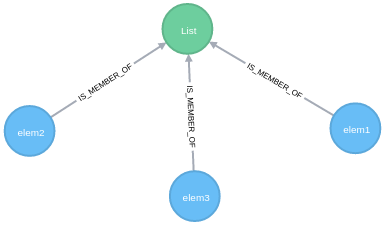
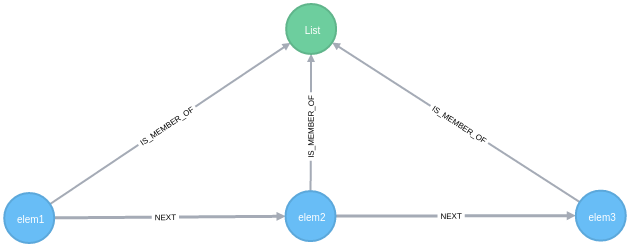
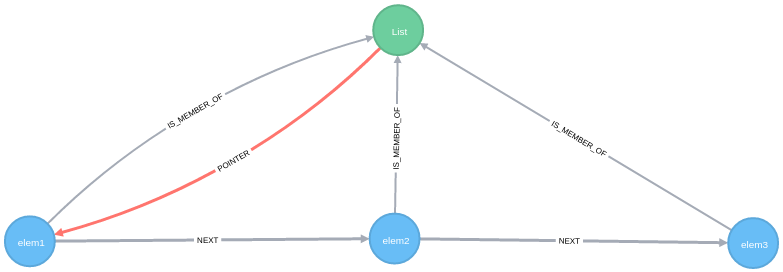
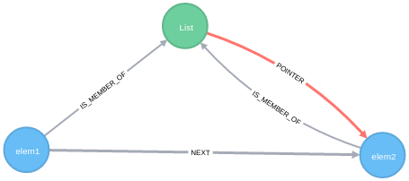
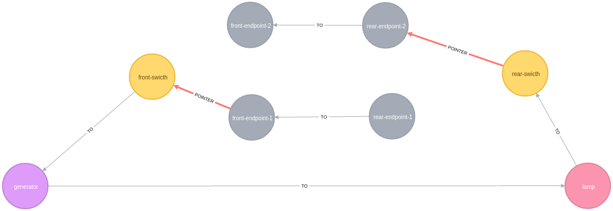

# Moving relationships

## introduction

A graph database is not only a simple way to store connected data, it is also a powerful tool to manage dynamic relationships between data. 
Since relationships are natively implemented in Neo4j, we can use them as a simple way to identify a group of connected nodes. But it is not the only usage we make of them.
It seems there is many use cases where Relationships move between nodes in subsequent queries. Theses relationships are specialized to store a particular state for a sub graph like a pointer for exemple. Let'go to study them.  

## Relationship as a pointer

Our first sample consist in observing this behavior is the famous Linked List. A linked list is a list where each item is ordered according to its relative position compared to the others items. On each call, the current pointed element is returned and then the pointer moves to the **next** element.

First we need to create a `:LIST` node with three `:ELEMENT`linked to it.

    MERGE (elem1:ELEMENT{name:"elem1"})-[:IS_MEMBER_OF]->(list:LIST)
    MERGE (elem2:ELEMENT{name:"elem2"})-[:IS_MEMBER_OF]->(list)
    MERGE (elem3:ELEMENT{name:"elem3"})-[:IS_MEMBER_OF]->(list)
    

Then we need to link theses elements in an relative ordered way (the initial position is not necessarily important, we chose here to match elements ordered by their name property) :

    MERGE (elem:ELEMENT)-[r:IS_MEMBER_OF]->(list:LIST)
    WITH elem ORDER BY elem.name ASC
    WITH COLLECT(elem) AS elems
    FOREACH (n IN RANGE(0, LENGTH(elems)-2) |
    FOREACH (prec IN [elems[n]] |
    FOREACH (next IN [elems[n+1]] |
    MERGE prec-[:NEXT]->next)))

Here we use an iterator (the first `FOREACH` clause) to browse the collection of elements and to create a relationship between the prev node and the next node. If you need more explanation about this query, you can find a very interesting post from Mark Needham here: [Neo4j: Cypher – Creating relationships between a collection of nodes](http://www.markhneedham.com/blog/2014/04/19/neo4j-cypher-creating-relationships-between-a-collection-of-nodes-invalid-input/ "Neo4j: Cypher – Creating relationships between a collection of nodes")

The next step consists in placing a pointer at the initial position meaning on the header element of this list (the element without `:NEXT` incoming relationship) :

    MATCH (list:LIST)
    MATCH (elem:ELEMENT) WHERE NOT elem<-[:NEXT]-()
    MERGE list-[:POINTER]->elem 

And now, we need to write a typical query which returns the current pointed element and emulates the pointer movement.
Returning current element is simple :

    MATCH (list:LIST)-[:POINTER]->(current:ELEMENT) 
    RETURN current
    
But emulating the pointer movement requires three cypher operations :

1. Finding the next node
2. Deleting the current pointer relationship
3. Creating a new pointer relationship on the next node

The final query is:

    MATCH (list:LIST)-[p:POINTER]->(current:ELEMENT) 
    OPTIONAL MATCH current-[:NEXT]->(next:ELEMENT) 
    DELETE p 
    MERGE list-[pnew:POINTER]->next
    RETURN list,current,next,pnew
    

__The pointer moved !__

If we take five minutes to have a closer look at the relationships type, we have:

* `:IS_MEMBER_OF` to determine what the elements of this list are
* `:NEXT` to determine what the next element to the current one is
* `:POINTER` to determine what the current element is

As we can see, the nature of each relationship type is different. The first two ones have a long lifecycle (as long as the list exists) and the last one has another function : its lifetime may become short because it is only  a volatile state at a given  moment.

This is a __moving relationship__ !

## Relationships as a three-way switch

Yes, it is a weird title and a strange use case. I think that is interesting to introduce another way of thinking about relationships. Previously we were talking about a relationship as a pointer, now we have  to consider about __cross states__. And the best sample to talk about that is the electrical Three-way Switch.

In the hall of your house, you need to light the hall or light-off the hall according his prev state and your position in the hall. You must be able to light on the hall from the entry and off it from the other end. But you must able to close or open the light from elsewhere (it's not possible to think we need to ligth on the hall just at the position where we cut-off the last time).

From electricity it's called a Three-way switch, and his implementation is the followed :

source : https://en.wikipedia.org/wiki/Multiway_switching

Ok, but what is the link to graphs ?

Electrical needs circuit to have the light on, in graph theory it's called a cycle, then this schema could be stored in a graph. If we detect a cycle through theses elements then we can deduct the lamp enlight, no for else case.

First we need to give a representation of this schema to Neo4j, we consider the initial position where the lamp is off:

    CREATE 
    (generator:GENERATOR {name:"generator"}),
    (lamp:LAMP {name:"lamp"}),
    (s1:SWITCH {name:"front-switch"}),
    (e11:ENDPOINT {name:"front-endpoint-1"}),
    (e12:ENDPOINT {name:"front-endpoint-2"}),
    (s2:SWITCH {name:"rear-switch"}),
    (e21:ENDPOINT {name:"rear-endpoint-1"}),
    (e22:ENDPOINT {name:"rear-endpoint-2"}),
    generator-[:TO]->lamp,
    lamp-[:TO]->s2,
    s2-[:POINTER]->e22,
    e22-[:TO]->e12,
    generator<-[:TO]-s1,
    e11-[:POINTER]->s1,
    e11<-[:TO]-e21

