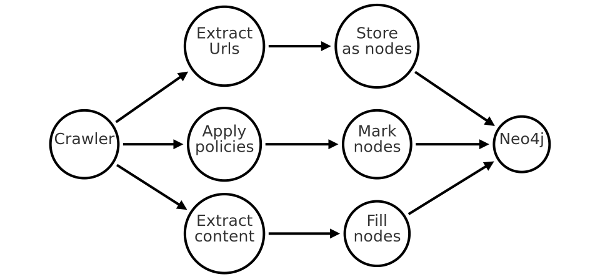
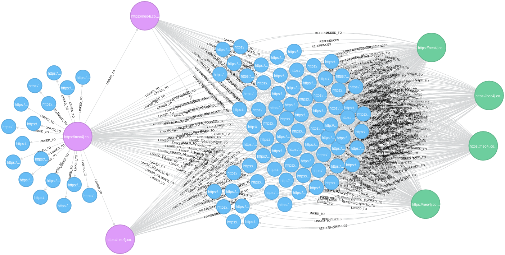

# Check your Crawler with Neo4j!

## Introduction

Ixxo Web Mining has developped a product called Fetch-Server. This is a configurable Web Spider (aka Web Crawler) who can fetch the Web 
to extract data and push it into the Ixxo Indexer like showed in the schema below:


After downloading the interesting part of a Web page, the Fetch Server sends the data to the Ixxo Indexer, able to extract entities from data (like Organizations, Countries, etc.).

Neo4j helped us to rule our Crawler by checking page traversal of it. 
 

## How a Web Spider works?

A Web Spider is a process able to recursively download pages and extract URLs from them. Then the extracted URLs are downloaded and so on.


Each extracted Url is put into a queue called Frontier. The treatment polls the next url in the Frontier and download the page. 
Usually, any Crawler implements some common features: 

* A selection policy: a white list/black list principle to rule the pages to download or not
* A politness policy: a think time or other stuffs to ensure to the visited site we are not malicious
* A re-visit policy: a trigger to say to the main process that page has changed and we need to download it again

## How the Fetch-Server works?

The Fetch-Server is a Web Spider with the following features:
* The selection policy is divided in two parts: a URLs selection policy (download the page or not) and a Content selection policy (to send the extracted data to Ixxo Indexer or not)
* The politness policy is ruled by a think time and the robots.txt file management
* The re-visit policy is enabled or disabled by the user and based on the page checksum 
* CSS Selector policy for text extraction
* Many other parameters...

Technically, the Fetch-Server is drivable by Restful api:
```
{
  "message" : "Oxway Fetch Server",
  "version" : "Version ${version}",
  "links" : [ {
    "rel" : "self",
    "href" : "http://localhost:8080"
  }, {
    "rel" : "fetchs.command.test",
    "href" : "http://localhost:8080/fetchs/fetch"
  }, {
    "rel" : "fetchs.command.start",
    "href" : "http://localhost:8080/fetchs/fetch"
  }, {
    "rel" : "fetchs.command.delete",
    "href" : "http://localhost:8080/fetchs/delete/{id}"
  }, {
    "rel" : "fetchs.command.stop",
    "href" : "http://localhost:8080/fetchs/stop/{id}"
  } ]
}
```
## Fetch-Server in development: the questions

Somebody says "The real coder doesn't test. Only the ones who fear are testing". So, I was frightened then. 

During the development of the Fetch-Server, when almost parameters were managed and basic commands implemented, I ask myself about how to be sure of the crawler behaviour.

How to be sure that my parameters are rightly interpreted by my crawler? Unit testing? Sure, but Web pages are volatiles and it's difficult to obtain a predictable result on the long term. Futhermore, I want to inspect the traversals done by the crawler before connecting the server with the Ixxo Indexer for avoid data pollution.


## Admirable Ackbar: it's a graph!

Yes it is. I talked about traversals, Web links... No doubt, it's a graph and the right tool here is Neo4j. 
I need to store extracted URLs and Web pages, and, at this point of the development, I have to go fast because this is an extra workload. 
Neo4j proves me that was an efficient database in the past, simple to up, a good console, CYPHER for querying relationships and paths, and a great community, nice! 

Well, I write a Neo4j's URL extractor to store, from a page, all URLs as nodes and to link them to the current page node.
Also, I write a Neo4j's Listener for sending crawl events to Neo4j and mark nodes with labels regarding the crawl policies:

* URL_ACCEPTED : this Url is accepted, the page will be downloaded and Urls extracted from this page at the next cycle
* CONTENT_ACCEPTED : this page is in the white list, then the selected content is extracted (the node with CONTENT_ACCEPTED is obviously an URL_ACCEPTED) 


All other status are considered as REJECTED.



## Crawling the Web

Well, now it's time to run my first Crawl. I Chose the Neo4j's blog and I provide the following parameters to the Fetch-Server:

Parameter | value
------------ | -------------
Start URL | https://neo4j.com/blog/
Withe list for Urls | https://neo4j.com/blog/  https://neo4j.com/blog/page/*
Withe list for content | https://neo4j.com/blog/+
Black list for content | https://neo4j.com/blog/page/* https://neo4j.com/blog/ https://neo4j.com/blog/contributor/*
Max depth | 4

Running and obtaining the following sample (limited to 25 results):



* In magenta color, the pages with URL_ACCEPTED only tag
* In green, the pages with URL_ACCEPTED and CONTENT_ACCEPTED tags
* In blue the rejected pages.

## Cross Crawls


