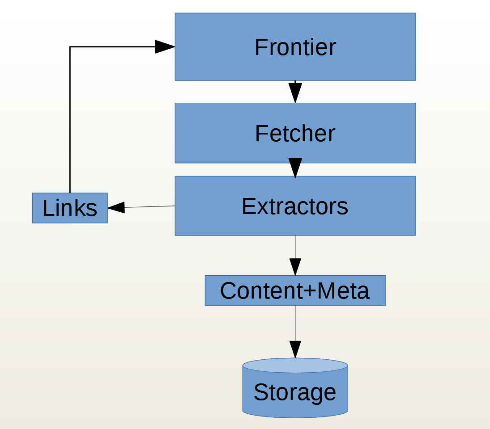
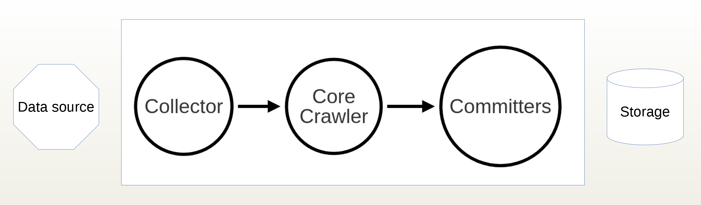
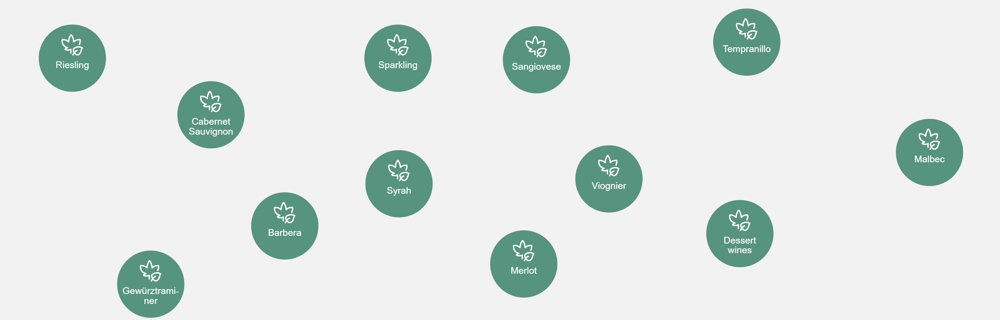
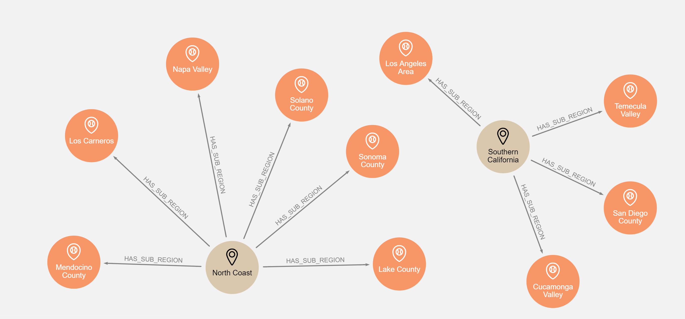
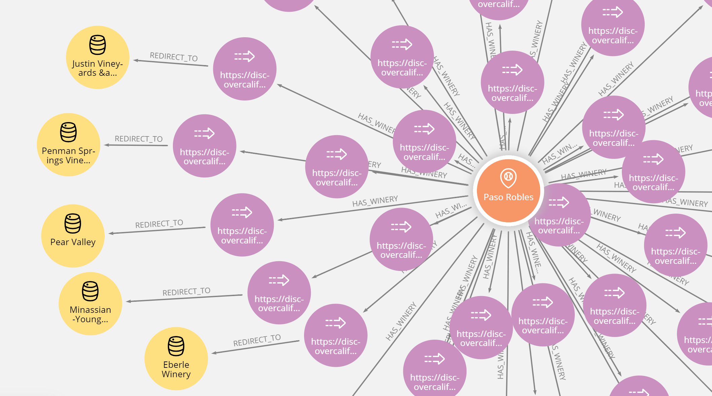
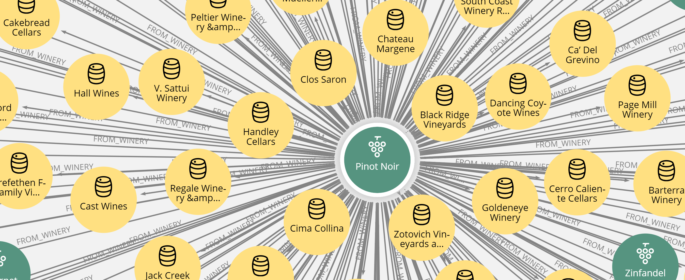
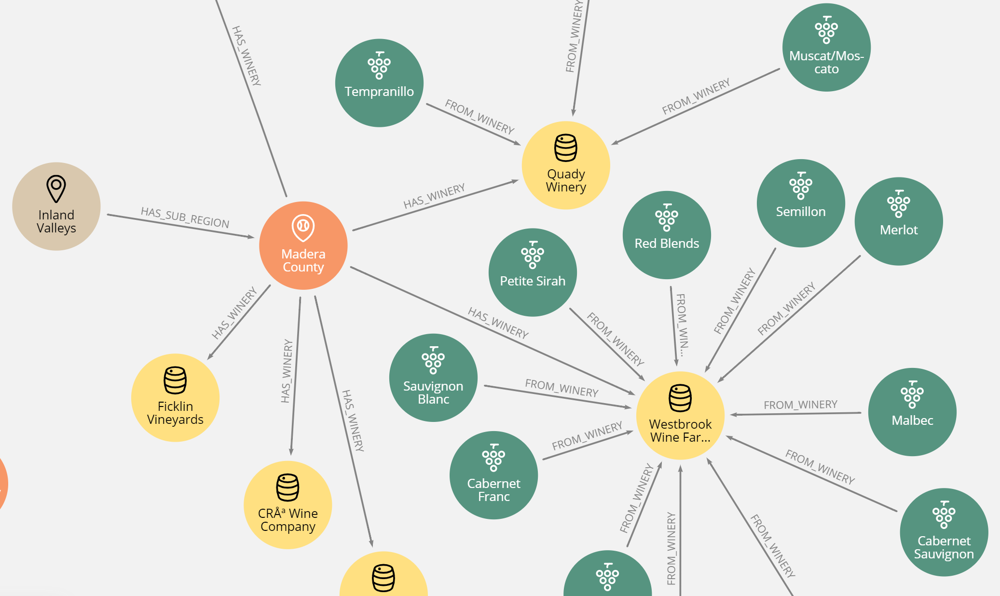

= Importing data from the web with Norconex & Neo4j


image::committer-neo4j.png[]

== Introduction

Neo4j provides many tools for importing data, such as LOAD CSV (from Cypher queries) and the neo4j-admin import tool. It is also possible to import data from many other systems like Elastic Search, SQL databases, MongoDB, and CouchBase (using an APOC procedures plugin). Finally, ETL tools like Kettle provides features which aims the effort needed for the data transformation. In short, the data manipulation ecosystem around Neo4j is very nearly complete. 

To add another facet to this ecosystem, we present a way for Neo4J to obtain data directly from the Web. To do this we use an external tool called a Web Crawler (also known as a Web Spider or a Web Scraper).

== What is a Web Crawler ?

A Web Crawler is a robotic program which specializes in browsing the Web, digging more and more deeply by following links. The basic operation is pretty simple.

Consider the following cycle of work:

* download a Web page
* extract the links from this page to other pages and add them to the _frontier_ (a pool of URLs)
* extract content and meta-data from this page and store it somewhere



== Caution: politness rules

While it's true that the basic principle of crawling is simple, to be a good internet citizen you must respect politness rules. This is really important--we don't want to end up _attacking_ a web site, we just want to grab useful data!

Here are some politness rules:

* Provide a _think time_, that is a time delay between two hits.  This gives the target host some time to catch its breath. Also avoid hitting a site with more than one thread
* Respect site rules contained in ROBOTS.TXT files and No-follow directives
* Be careful not to download personal data

If you are impolite, you risk being blacklisted, or, worse, to knock over the remote server.  This is clearly not a good way to treat a site whose data we need!

== Norconex Web Crawler

Norconex is an IT company located in Gatineau, Quebec, Canada, which specializes in enterprise internet searchs. Norconex provides a very nice open source Web Crawler, known as _HTTP Collector_. The Norconex crawler is, in essense, a generic pluggable crawl engine.  Take a look at its structure on the image below:  



Many collectors are provided by Norconex (Http, FileSystem, etc.)  In addition many connectors, called _committers_, are provided which inject data, (SQL, Elastic Search, Solr, etc.).

Using a simple XML configuration, you can connect an input (a data collector) to an output (a committer).  You can also apply filters or perform data transformation between the collector and the committer.

The newest committer is the _Neo4j committer_.

== Meet the California grapes

I live in Burgundy, France, and I have enjoyed tasting many wines from this region (as well as from other regions in France). Especially important are the Pinot Noir grape, for red wines, and the Chardonnay grape for white wines. 

There is an interesting wine history between the New and Old Worlds.  Many European grape varietals were exported from Europe to United States.  This was of critical importance because in the 19th century the Phylloxéra aphid plague wreaked havoc, damaging vineyards on the European continent (especially France).  The French grapes were ultimately saved using greffons from American foot vines.

Despite this historical connection, I don't really know much about American wines. After reading an article, I decided I should introduce myself to California wines (which make up about 90% of the American wine production).

Ok, let's go to meet the California grapes...

== Norconex considerations

A crawl is configured by XML. 
Consider the following points:

* Metadata is the information placed in the `<head/>` section of the HTML page, plus some information added by the Norconex engine (as `collector.referenced-urls` which stores all the links available on this page). This data is stored as key/value pairs.
* Content is the main content placed in `<body/>` section of the HTML page

You can see the flow of the HttpCollector here: link:ex-url.adoc[https://www.norconex.com/collectors/collector-http/flow]

== Finding sources

After searching the Internet, I found a good start point: link:ex-url.adoc[https://discovercaliforniawines.com/]
It contains data about regions, sub-regions, wineries and grapes. My goal is to build a graph with the data to display how each grape varietal is divided over the regions or sub-regions.

After some site analysis, I decide to split this work in two crawls:

* importing varietals first (one XML configuration)
* importing regions, sub-regions and wineries then (another XML configuration)

Later, I'll probably need to _wash_ the data to eliminate _noise Nodes_ (unwanted nodes or relationships).

== Import grape varietals



=== Starting with sources (start Urls)

By inspecting the source code for this page: link:ex-url.adoc[https://discovercaliforniawines.com/wine-map-winery-directory/], I find there is a search selector which lists all the kinds of grapes, the text values being the grape names and the option value attribute being the Ids.

I'll begin the XML configuration by specifying the starting Urls:

```
...
<startURLs stayOnDomain="true" stayOnPort="true" stayOnProtocol="true">  
      <url>https://discovercaliforniawines.com/wine-map-winery-directory/</url>                         
</startURLs>
...
```

=== Making one document to many

Norconex is able to split one document into many documents, based on a CSS selector. This way I can split each option on this `<select/>` tag:

```
...
 <importer>
        <preParseHandlers>          
          <splitter class="com.norconex.importer.handler.splitter.impl.DOMSplitter"
            selector="#varietal_select option"
            parser="html"/>
...
```

The _importer_ phase is reached when the document (the Web page) passes through filters, and then the document treatment process begins. Here, the `DOMSplitter` component makes one document (imported as new document) for each tag matching the CSS selector `#varietal_select option`.

=== Adding _value_ and _id_ 

Each new document content built by the `DOMSplitter` looks like (as an example):

```
<option class="text-dark" value="1554">Cabernet Sauvignon<option>
```

It will be useful to extract the text _value_ and _id_ to put them in the metadata. As we will see later, the varietal can then be linked to wineries with this identifier.

Norconex provides a component to extract data from CSS Selector, the `DOMTagger`:

```
...
        
          <tagger class="com.norconex.importer.handler.tagger.impl.DOMTagger">
              <dom selector="option"  toField="varietal_id"   extract="attr(value)"/>
              <dom selector="option"  toField="varietal"   extract="ownText"/>             
          </tagger>
...
```

=== Stamping these pages with varietal type

To provide more qualified information when the document will be stored to Neo4j (see later _additionnal labels_), we're going to add a constant on each page imported from the document splitter.

Norconex provides a `ConstantTagger` to add a explicit value to a metadata field--here the field is _TYPE_:

```
...        
          <tagger class="com.norconex.importer.handler.tagger.impl.ConstantTagger"
              onConflict="replace" >      
            <restrictTo caseSensitive="false" field="document.embedded.reference">
               #varietal_select.*
            </restrictTo>
            <constant name="TYPE">VARIETAL</constant>
          </tagger>
           
      <preParseHandlers>
   <importer>
...
```

The `restrictTo` element allows us to provide a regular expression to filter the documents tagged.

=== Storing in Neo4j

The ultimate goals is to store the data in Neo4j.

First of all, we choose the committer Norconex provides for Neo4j : `com.norconex.committer.neo4j.Neo4jCommitter`
This committer must be configured with the following information:

* The Neo4j connection information
* The node topology (SPLITTED, ONE_NODE, NO_CONTENT)
* the primary label
* the additional labels (optional): 
* the relationships definitions (optional)

Other configuration information is mostly commot to all the other Norconex committers.

```
...
	<committer class="com.norconex.committer.neo4j.Neo4jCommitter">
		<uri>bolt://localhost:7687</uri>
		<user>neo4j</user>
		<password>neo4j</password>
		<authentType>BASIC</authentType>      

		<nodeTopology>NO_CONTENT</nodeTopology>
		<primaryLabel>CALIFORNIA</primaryLabel>

		<additionalLabels>
			<sourceField keep="true">TYPE</sourceField>
		</additionalLabels>   

		<sourceReferenceField keep="true">document.reference</sourceReferenceField>
		<targetReferenceField>identity</targetReferenceField>

		<queueSize>5</queueSize>
	</committer>
...
```

==== Node Topology

The node topology defines how a Web page must be stored in Neo4j.

* ONE_NODE: the page will be stored in one node which contains metadata and content
* NO_CONTENT: the page will be stored in one node wich contains only metadata
* SPLITTED: the page will be stored in three nodes, one super node linked to another one which contains metadata and linked to another one which contains content

In my case, I'm not interested in the content--I want only to know how the entities are linked. So I chose the `NO_CONTENT` topology.


==== Primary label

All nodes imported by this crawl will be stamped with a label by this literal value. This makes it easy to delete or search only on them.

==== Additional labels

Additional labels are used to define the nodes more precisely. Here we need to parameterize a metadata field. The value of this key will be converted into a label on the node.

Remember that earlier a constant, named _TYPE_, was configured with the `ConstantTagger`  This is this value I want to add to new nodes. 

=== Starting Norconex and check the result

Now my configuration is completed, I can launch the Web crawler:

```
$> sh collector-http -a start -c confs/california-varietals.xml
```

* _-a_: the action, start or stop
* _-c_: the config file path

When it finishes I can check the imported Neo4j data:
```
MATCH (v:VARIETAL) RETURN v.varietal, v.varietal_id
```

And the query produces the following result:

|===
|n.varietal |n.varietal_id |n.varietal |n.varietal_id |n.varietal |n.varietal_id |n.varietal |n.varietal_id

|All Varietals
|null
|Barbera
|1556
|Cabernet Franc
|1555
|Cabernet Sauvignon
|1554 

|Chardonnay
|1529
|Chenin Blanc
|1539
|Dessert wines
|1540
|Gewürztraminer
|1538 

|Grenache Blanc
|1537
|Grenache
|1553
|Malbec
|1552
|Marsanne
|1528

|Merlot
|1551
|Mourvèdre
|1550
|Muscat/Moscato
|1536 
|Petite Sirah
|1549

|Pinot Blanc
|1535 
|Pinot Gris
|1527
|Pinot Noir
|1548
|Red Blends
|1547

|Riesling
|1534
|Rosé
|1542
|Roussanne
|1533
|Sangiovese
|1545

|Sauvignon Blanc
|1532
|Semillon
|1526
|Sparkling
|1541
|Syrah
|1544

|Tempranillo
|1546 
|Viognier
|1531
|White Blends
|1530
|Zinfandel
|1543
|===

As we can see, we've gotten some unwanted data, that is _All Varietals_.  This is because it was the first value in the varietal selector on the web page.
We can clean up this data by deleteing all nodes where `varietal_id` is null:

```
MATCH (v:VARIETAL) WHERE v.varietal_id IS NULL DELETE v
```

== Import regions and sub-regions




=== Start Url and link extractor

Now I want to import the California regions and their sub-regions. This web at site has a page at `https://discovercaliforniawines.com/discover-california/`.  This page has a sub-banner with links to all the regions (NORTH COAST, CENTRAL COAST, etc). And on each page of these regions, there are the links to sub-regions (Lake Country, Los Carneros, etc.). Nice.

My starting Url will be `https://discovercaliforniawines.com/discover-california/` but I don't want to extract all links from this page, because there are links to thing that are not useful for my purposes, such as links to events, media, etc.

So, so I really only want to extract links from the sub-banner with the css selector `#page-menu-bar`.  This will also reduce the processing time.

Norconex allows us to modify the default behavior of its link extractor like this: 

```
...
	<linkExtractors>
		<extractor class="com.norconex.collector.http.url.impl.GenericLinkExtractor">
			<extractSelector>#page-menu-bar</extractSelector>   
			
		</extractor>
	</linkExtractors>
...
```
Note: There are many other parameters for the `GenericLinkExtractor` and other usages too.


=== Reference and document filters

We need to say a bit here about filters.  The _reference filters_ are based on the extracted links, whether or not we put them into the frontier. _document filters_ are triggered when the document is downloaded, and filtering is based on the documents's meta-data or content.

Our filters are using the Norconex `RegexReferenceFilter`, a filter based on the reference of the document or its link: 

```
...
	<filter class="com.norconex.collector.core.filter.impl.RegexReferenceFilter" onMatch="include">
      		https://discovercaliforniawines.com/discover-california/.*
        </filter>
...
```

=== Constant TYPE for additional labels

As we did with varietal, we need to qualify our new nodes more precisely:

```
...
	<tagger class="com.norconex.importer.handler.tagger.impl.ConstantTagger"
              onConflict="noop" >      
            <restrictTo caseSensitive="false" field="document.reference">
                https://discovercaliforniawines.com/discover-california/[\w-?]*/?{0,0}
            </restrictTo>
            <constant name="TYPE">CALIFORNIA_REGION</constant>
        </tagger>
        <tagger class="com.norconex.importer.handler.tagger.impl.ConstantTagger"
              onConflict="noop" >      
            <restrictTo caseSensitive="false" field="document.reference">
                https://discovercaliforniawines.com/discover-california/[\w-?]*/.*
            </restrictTo>
            <constant name="TYPE">CALIFORNIA_SUB_REGION</constant>
        </tagger>
...
```

=== Neo4j committer: creating the relationships

Creating the Neo4j relationships is probably the most difficult and interesting part of a configuration.  It is also essential because relationships are crucial to the graph.

First of all, we want to link regions to their sub regions. A region _HAS_ a sub region. Each time we parse a _CALIFORNIA__REGION_ tagged document, we want to create a relationship to a _CALIFORNIA__SUB__REGION_ with the relationship type _HAS__SUB__REGION_

Take a look at the following configuration:

```
	<relationships>
		<relationship type="HAS_SUB_REGION" direction="OUTGOING" targetFindSyntax="MERGE" regexFilter="https://discovercaliforniawines.com/discover-california/[\\w-?]+/.+">

			<sourcePropertyKey label="CALIFORNIA_REGION">collector.referenced-urls</sourcePropertyKey>
		 	<targetPropertyKey label="CALIFORNIA_SUB_REGION">identity</targetPropertyKey>
		</relationship>
	</relationships>
```

* the _type_ attribute is the name of the Neo4j's relationship.
* the _direction_ attribute denotes its sense.
* the _targetFindSyntax_ gives the way the CYPHER query is to be created with these parameters. With `MATCH`, if the targeted node doesn't exist, then the relationship will not be created; with `MERGE`, if the targeted node doesn't exist, it will be created.
* the _regexFilter_ attribute allows us to apply the relationship only on the pages where the source property value (see below) matches the regex. This will avoid linking spurious nodes. 

The following elements are :

* _sourcePropertyKey_: to define constraints for building the relationship from the current committed page
* _targetPropertyKey_: to define the concerned nodes that should be linked

_label_ attribute is an optional constraint, and in this case each node source or target (or both) must have the requisite label.

Finally, the value inside the element will be evaluated from a meta-data property (for source) and from a node property (for target).
If the source value is multi-valued (like `collector.referenced-urls`) then one relationship could be created for each value.

To summarize, each url in the source meta-data property `collector.referenced-urls` which matches the regex filter is going to create a relationship with a target which has a property `identity` (default _id_ if not otherwise specified in the `document.reference`, it will default to the page url) when a match occurs. If there is no match, the target node is created (because we set `targetFindSyntax="MERGE"`) with the provided identity and the label specified by the constraint in the target node. The targeted node will be completed later when the crawler reaches the concerned pages. 


== Linking sub-regions with grape varietals through wineries

We have no way to link sub-regions to varietals directly. On this web site, varietals are only referenced by wineries. But we can first link sub regions to wineries and then link wineries to varietals.

=== Importing wineries




Importing wineries is not so easy, because there are redirections between sub-region pages to wineries pages.  For example the link
`https://discovercaliforniawines.com/wineries/acorn-wineryalegria-vineyards-2/` from the sub-region page is redirected to `https://discovercaliforniawines.com/wine-map-winery-directory/#winery=1393050&search=ACORN%20Winery%2FAlegr%C3%ADa%20Vineyards`.
To handle this situation and to get a continuous linkage between these pages, we'll need to link them. 

First, tagging nodes for TYPE:
```
<tagger class="com.norconex.importer.handler.tagger.impl.ConstantTagger"
            onConflict="noop" >      
   <restrictTo caseSensitive="false" field="document.reference">
      https://discovercaliforniawines.com/wineries/.*
   </restrictTo>
   <constant name="TYPE">WINERY_REDIRECTION</constant>
</tagger>
          
<tagger class="com.norconex.importer.handler.tagger.impl.ConstantTagger"
            onConflict="noop" >      
    <restrictTo caseSensitive="false" field="document.reference">
       https://discovercaliforniawines.com/wine-map-winery-directory/.+
    </restrictTo>
    <constant name="TYPE">WINERY</constant>
 </tagger>
```

Then, I'm going these specify this kind of node via the property `redirect-trail` on the targeted page meta-data (which is injected by Norconex).  We can do this by :
```
<relationship type="REDIRECT_TO" direction="INCOMING" targetFindSyntax="MATCH">         
   <sourcePropertyKey label="WINERY">collector.redirect-trail</sourcePropertyKey>
   <targetPropertyKey label="WINERY_REDIRECTION">identity</targetPropertyKey>
</relationship> 
```

This configuration leads the creation of links between nodes like: `(wineryUrlFromSubregion)-[:REDIRECTED_TO]-(wineryLink)`

=== Linking sub-regions

Having done this, the rest is pretty simple.  Because we couldn't link the *CALIFORNIA_SUB_REGION* nodes to *WINERY* nodes, we have to link the *CALIFORNIA_SUB_REGION* to *WINERY_REDIRECTION* nodes.

```
<relationship type="HAS_WINERY" direction="OUTGOING" targetFindSyntax="MERGE" regexFilter="https://discovercaliforniawines.com/wineries/.+">         
   <sourcePropertyKey label="CALIFORNIA_SUB_REGION">collector.referenced-urls</sourcePropertyKey>
   <targetPropertyKey label="WINERY_REDIRECTION">identity</targetPropertyKey>
</relationship>
```

Note: the region "Far North California" doesn't have a sub-region, and to make this article more readable, the relationship configuration is not showed here.  But it is available in the full configuration (see below: external resources).

=== Linking varietals



Creating varietals links comes with a bit of complexity. To link a winery to matched varietal, we have to extract the varietal Ids from data on the page `https://discovercaliforniawines.com/wine-map-winery-directory/`.
The winery selector has a lot of data like _varietals-id_. 
Using javascript, we can extract these varietals Ids and put them in the winery meta-data, with a new field called _varietals_:
```
<tagger class="com.norconex.importer.handler.tagger.impl.ScriptTagger">
             <restrictTo caseSensitive="false" field="document.reference">
             https://discovercaliforniawines.com/wine-map-winery-directory/.+
            </restrictTo>
            <script><![CDATA[
	        // extract winery id from Url
                var wineId =  reference.substring(
                    reference.indexOf("=") + 1, 
                    reference.lastIndexOf("&")
                );
                metadata.addString('winery-id', wineId);
                
                // transform text content to Html DOM
                var jsoup = org.jsoup.Jsoup.parse(content);
		// retrieve element relative to current winery
                var elems = jsoup.getElementsByAttributeValue("data-id", wineId);
                var elem = elems.first();
                if (elem != null){
		  // extract data-varietals and transform array [] to | value separator
                  var varietals = elem.parent().attr("data-varietals");
                  varietals= varietals.replace("[","");
                  varietals= varietals.replace("]","");                 
                  var parts = varietals.split (","); 
                  for (i = 0 ; i < parts.length ; i++){
                    metadata.addString('varietals', parts[i]);
                  }                  
                }
                else metadata.addString('varietals', 'none'); 
      
            ]]></script>
</tagger>       
```
Now, we're able to create the relationships from a winery to related varietals:
```
<relationship type="FROM_WINERY" direction="INCOMING" targetFindSyntax="MATCH">         
   <sourcePropertyKey label="WINERY">varietals</sourcePropertyKey>
   <targetPropertyKey label="VARIETAL">varietal_id</targetPropertyKey>
</relationship>
```
Et voilà !

Note: labels filters on _sourcePropertyKey_ and _targetPropertyKey_ elements are not mandatory (because they are implicit in the graph). But, they are an easy way here to document the relationship.

== Cleaning the graph




Nice. I have a graph but this graph feels more like a crawl graph than a business graph. That is to say, we have many nodes that are artifacts of the Norconex web crawler download pages.
For example, we don't need the *WINERY_REDIRECTION* nodes at all anymore. So, we'll clean up the graph by removing them and  building relationships directly between sub-regions and wineries, via the following query:
```
MATCH (n)-[:HAS_WINERY]->(wr:WINERY_REDIRECTION)-[:REDIRECT_TO]->(w:WINERY) 
DETACH DELETE wr 
MERGE (n)-[:HAS_WINERY]->(w)
```


== Querying the graph

And now we can query the graph! First, we might like to know about the related regions and sub-regions:

```
MATCH (r:CALIFORNIA_REGION)
OPTIONAL MATCH (r)-[:HAS_SUB_REGION]->(sr:CALIFORNIA_SUB_REGION) 
RETURN r.value AS Region, COLLECT(sr.value) AS Subregions
```

|===
|Region |Subregions 

|"North Coast" 
|["Solano County", "Napa Valley", "Lake County", "Los Carneros", "Mendocino County", "Sonoma County"]

|"Central Coast" 
|["Monterey County", "Santa Barbara County", "San Luis Obispo County", "San Benito County", "Livermore Valley", "Paso Robles", "San Francisco Bay", "Santa Clara Valley", "Santa Cruz Mountains"]

|"Far North California" 
|[]

|"Inland Valleys" 
|["Lodi and the Delta", "Sacramento Valley", "San Joaquin Valley", "Madera County"]

|"Southern California" 
|["Los Angeles Area", "Cucamonga Valley", "Temecula Valley", "San Diego County"]

|"Sierra Foothills" 
|["Amador County", "Placer County", "Yuba County", "Nevada County", "Calaveras County", "El Dorado County"]
|===

Next, say we want to know how many wineries are in each region: 

```
MATCH (r:CALIFORNIA_SUB_REGION)-[:HAS_WINERY]->(w:WINERY)
RETURN r.value AS SubRegion, count(w) AS WineriesCount 
ORDER BY WineriesCount DESC
```

|===
|Region |SubRegion |WineriesCount 

|"North Coast"
|"Napa Valley"	
|128

|"North Coast"
|"Sonoma County"
|110

|"Central Coast"
|"Paso Robles"	
|43

|"Central Coast"
|"Santa Barbara County"	
|41

|"Central Coast"
|"San Luis Obispo County"	
|26

|...
|...
|...
|===

Unsurprisingly, _Napa Valley_ is at the top of the list.  After all, _Napa Valley_ is the only one American wine region I knew of up to now.

And finally, we can see how many types of wineries cultivate each kind of grapes:

```
MATCH (r:CALIFORNIA_REGION)
MATCH (r)-[:HAS_SUB_REGION]->(sr:CALIFORNIA_SUB_REGION)
MATCH (sr)-[:HAS_WINERY]->(w:WINERY)
MATCH (w)<-[:FROM_WINERY]->(v:VARIETAL)
WITH r,w, v ORDER BY v.value
RETURN v.value AS Varietal,COUNT(w) AS WineriesCount 
ORDER BY WineriesCount DESC
```

|===
|Varietal |WineriesCount 

|"Cabernet Sauvignon"	
|329

|"Chardonnay"	
|316

|"Syrah"	
|228

|"Zinfandel"	
|224

|"Pinot Noir"	
|219

|"Merlot"	
|202

|"Sauvignon Blanc"	
|190

|...
|...
|===

We see that _Cabernet Sauvignon_ is the most widely cultivated grape in California, at 329 wineries (out of 598). _Cabernet Sauvignon_ is a red grape variety known worldwide, and it has become one of the most widespread grape varieties in the world. It owes its international recognition to the great wines from the vineyards of Bordeaux, France. _Chardonnay_, in second place, is a white grape from the vineyards of Burgundy, France. It is not only used to make great white wines but also to make sparkling champagne wines.

== Beyond this sample

This is certainly more interesting to work with winery surfaces instead of wineries count to really see what kind of grapes are the most cultivated. Also, with surfaces, we can find out what wineries are the most influential actor in a region.
We can build a map to locate where the wineries are (and also compute a density). We might think about improving the varietal nodes by adding color or origin data, and by crossing this data with another crawl based on another web site which contains that kind of information. So you see, this sample could be extended to become a valuable data source about Californian wines.


== Conclusion

Norconex and Neo4j make a powerful combination. Using the Neo4j Committer, we are able to grab linked data instead of data in the traditional table format. However, Norconex is also able to run many committers simultaneously, so we could imagine storing related data in Neo4j and content data (like text) in Elastic Search in a single pass, for example.

== Resources

All images in this article are built from Neo4j Bloom vizualisation tool: link:ex-url.adoc[https://neo4j.com/bloom/]

The Norconex configuration is based on Neo4j Committer v2:  link:ex-url.adoc[https://www.norconex.com/collectors/committer-neo4j/] and the Norconex Http-Collector v2.9.0-SNAPSHOT : link:ex-url.adoc[https://www.norconex.com/collectors/collector-http/releases#a2.9.0-SNAPSHOT]

You can find the two full configuration files here :

* varietal configuration: link:ex-url.adoc[https://github.com/sylvainroussy/NeoBlogs/blob/master/norconex/california-varietals.xml]
* regions and wineries configuration : link:ex-url.adoc[https://github.com/sylvainroussy/NeoBlogs/blob/master/norconex/california.xml]

_Thank you very much to Frank Kutler for reviewing._

